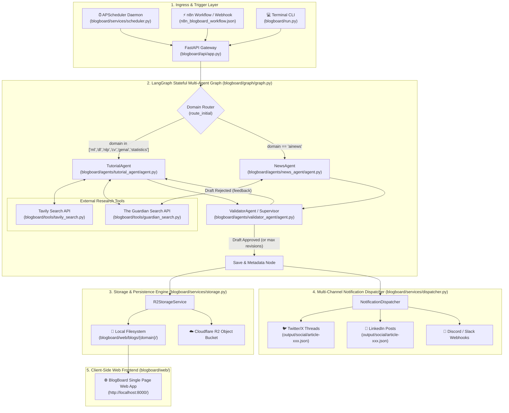

# 🚀 BlogBoard AI — Autonomous Multi-Agent Content Engine

[](https://www.python.org/)
[](https://fastapi.tiangolo.com/)
[](https://www.langchain.com/langgraph)
[](https://groq.com/)
[](LICENSE)

**BlogBoard AI** is an enterprise-grade, fully autonomous multi-agent content creation, validation, publishing, and social media distribution platform.

Powered by **LangGraph** stateful cyclic DAG execution, **FastAPI** REST API Gateway, **APScheduler** background daemon, and **Groq** high-speed LLM inference, BlogBoard automatically researches, drafts, validates, publishes, and broadcasts deep-dive technical articles across 7 domains (`ML`, `DL`, `NLP`, `CV`, `Gen AI`, `Stats`, `AI News`).

---

## 🌟 Key Features

- 🤖 **Stateful Multi-Agent Architecture (LangGraph)**
  - **TutorialAgent**: Conducts web research (Tavily / The Guardian API) and drafts technical tutorials.
  - **NewsAgent**: Gathers real-time AI news headlines and synthesizes editorial summaries.
  - **ValidatorAgent**: Functions as an automated supervisor reviewing technical accuracy, completeness, and H1 structure in a cyclic revision loop.

- ⏰ **Autonomous APScheduler Daemon**
  - Runs in the background 24/7.
  - Automatically identifies stale/least-recently updated categories and generates fresh articles without human intervention.

- 🌐 **FastAPI REST API Gateway & Swagger Docs**
  - Includes `POST /api/v1/trigger`, `GET /api/v1/status`, and `GET /api/v1/health`.
  - Interactive Swagger UI dashboard live at `http://localhost:8000/docs`.

- 📱 **Multi-Channel Notification & Social Dispatcher**
  - Formats ready-to-post **Twitter/X Threads** and **LinkedIn Posts** saved to `output/social/`.
  - Supports Discord, Slack, and Telegram webhooks.

- 🔗 **n8n Workflow Integration Template**
  - Includes a 1-click [`n8n_blogboard_workflow.json`](n8n_blogboard_workflow.json) template for no-code automation.

- 💾 **Dual-Mode Abstraction Storage Layer**
  - Zero-config **Local Filesystem** storage under `blogboard/web/blogs/`.
  - Optional production support for **Cloudflare R2** S3-compatible object storage.

- 🎨 **Modern Dark-Mode Web Frontend**
  - Pure HTML/CSS/JS client-side Markdown parser (Marked.js) with syntax highlighting (Highlight.js), reading time indicators, and cache-busting.

---

## 🏗️ Detailed System Architecture

### 1. High-Level Multi-Agent Workflow



---


---

### 2. Core Component Mapping

| Architectural Layer | Core Module | Description |
|---|---|---|
| **API Gateway** | [`blogboard/api/app.py`](file:///c:/Users/Shashank%20Suthrave/Documents/Multi%20agent%20blog%20generation/BlogBoard-AI-Blog-Generator/blogboard/api/app.py) | FastAPI server hosting `/api/v1/trigger`, status endpoints, and static web mounting |
| **Scheduler Daemon** | [`blogboard/services/scheduler.py`](file:///c:/Users/Shashank%20Suthrave/Documents/Multi%20agent%20blog%20generation/BlogBoard-AI-Blog-Generator/blogboard/services/scheduler.py) | APScheduler background service running stale-domain selection every 24 hours |
| **Graph Orchestrator** | [`blogboard/graph/graph.py`](file:///c:/Users/Shashank%20Suthrave/Documents/Multi%20agent%20blog%20generation/BlogBoard-AI-Blog-Generator/blogboard/graph/graph.py) | LangGraph `StateGraph` compiled routing graph connecting all agents |
| **Tutorial Agent** | [`blogboard/agents/tutorial_agent/agent.py`](file:///c:/Users/Shashank%20Suthrave/Documents/Multi%20agent%20blog%20generation/BlogBoard-AI-Blog-Generator/blogboard/agents/tutorial_agent/agent.py) | Agent drafting deep-dive technical tutorials with upfront title H1 formatting |
| **News Agent** | [`blogboard/agents/news_agent/agent.py`](file:///c:/Users/Shashank%20Suthrave/Documents/Multi%20agent%20blog%20generation/BlogBoard-AI-Blog-Generator/blogboard/agents/news_agent/agent.py) | Agent gathering real-time AI news headlines and structuring digests |
| **Validator Supervisor** | [`blogboard/agents/validator_agent/agent.py`](file:///c:/Users/Shashank%20Suthrave/Documents/Multi%20agent%20blog%20generation/BlogBoard-AI-Blog-Generator/blogboard/agents/validator_agent/agent.py) | Quality control supervisor enforcing completeness, accuracy, and title sync |
| **Storage Abstraction** | [`blogboard/services/storage.py`](file:///c:/Users/Shashank%20Suthrave/Documents/Multi%20agent%20blog%20generation/BlogBoard-AI-Blog-Generator/blogboard/services/storage.py) | Dual-mode storage service writing to local `blogboard/web/blogs/` or Cloudflare R2 |
| **Notification Dispatcher** | [`blogboard/services/dispatcher.py`](file:///c:/Users/Shashank%20Suthrave/Documents/Multi%20agent%20blog%20generation/BlogBoard-AI-Blog-Generator/blogboard/services/dispatcher.py) | Service constructing Twitter threads and LinkedIn posts into `output/social/` |
| **Web Frontend** | [`blogboard/web/`](file:///c:/Users/Shashank%20Suthrave/Documents/Multi%20agent%20blog%20generation/BlogBoard-AI-Blog-Generator/blogboard/web/) | Dark-mode HTML/CSS/JS single-page web app with Marked.js and Highlight.js |

---

## 📁 Repository Structure

```text
BlogBoard-AI-Blog-Generator/
├── blogboard/
│   ├── agents/
│   │   ├── tutorial_agent/    # Tutorial drafting agent & prompts
│   │   ├── news_agent/        # Real-time AI news agent & prompts
│   │   └── validator_agent/   # Supervisor validation agent
│   ├── api/
│   │   └── app.py             # FastAPI Gateway server & static mounting
│   ├── config/
│   │   └── settings.py        # Pydantic environment configuration
│   ├── graph/
│   │   ├── graph.py           # LangGraph compiled StateGraph workflow
│   │   └── state.py           # BlogState TypedDict definition
│   ├── services/
│   │   ├── dispatcher.py      # Multi-channel social media & webhook dispatcher
│   │   ├── scheduler.py       # Autonomous APScheduler background service
│   │   └── storage.py         # Dual-mode R2 & local storage engine
│   ├── tools/
│   │   ├── tavily_search.py   # Tavily Web Research Tool
│   │   └── guardian_search.py # The Guardian API Search Tool
│   ├── web/                   # Dark-mode static frontend (HTML/CSS/JS)
│   └── run.py                 # Core CLI & Server entrypoint
├── output/                    # Local storage fallback & social thread outputs
├── n8n_blogboard_workflow.json# 1-Click n8n Workflow integration JSON
├── run_server.ps1             # 1-Click PowerShell launcher script
├── requirements.txt           # Python dependencies
└── README.md                  # Project documentation
```

---

## ⚡ Quick Start

### 1️⃣ Clone the Repository & Setup Virtual Environment

```powershell
git clone https://github.com/sutraveshashank/AgenticBlog-Engine.git
cd AgenticBlog-Engine/BlogBoard-AI-Blog-Generator

# Create & activate virtual environment
python -m venv myenv
..\myenv\Scripts\Activate.ps1

# Install dependencies
pip install -r requirements.txt
```

### 2️⃣ Configure Environment Variables

Create a `.env` file in the project root:

```env
LLM__API_KEY=your_groq_api_key_here
LLM__MODEL_NAME=openai/gpt-oss-120b
STORAGE__R2_ACCOUNT_ID=dummy
STORAGE__R2_ACCESS_KEY_ID=dummy
STORAGE__R2_SECRET_ACCESS_KEY=dummy
STORAGE__R2_BUCKET_NAME=dummy
```

---

## 🚀 Running the Engine

### Option A: Launch Server & Background Scheduler (Recommended)

Run the 1-click launcher:

```powershell
.\run_server.ps1
```

Or using python:

```powershell
python blogboard/run.py --serve
```

- 🌐 **Web Frontend**: [http://localhost:8000/](http://localhost:8000/)
- 📄 **Interactive Swagger API Docs**: [http://localhost:8000/docs](http://localhost:8000/docs)

---

### Option B: Run On-Demand Single Article Generation via CLI

```powershell
# Autonomous topic selection
python blogboard/run.py

# Specific topic & domain
python blogboard/run.py --topic "Understanding Diffusion Models in Generative AI" --domain "genai"
```


---

## 📊 API Reference

| Endpoint | Method | Description |
|---|---|---|
| `/` | `GET` | Serves the interactive BlogBoard Web UI |
| `/docs` | `GET` | Interactive Swagger API documentation |
| `/api/v1/trigger` | `POST` | Triggers immediate article generation (optional `domain`, `topic`, `dry_run`) |
| `/api/v1/status` | `GET` | Returns scheduler status & last updated dates per domain |
| `/api/v1/health` | `GET` | Health check endpoint |

---

## 📄 License

Distributed under the MIT License. See `LICENSE` for details.
